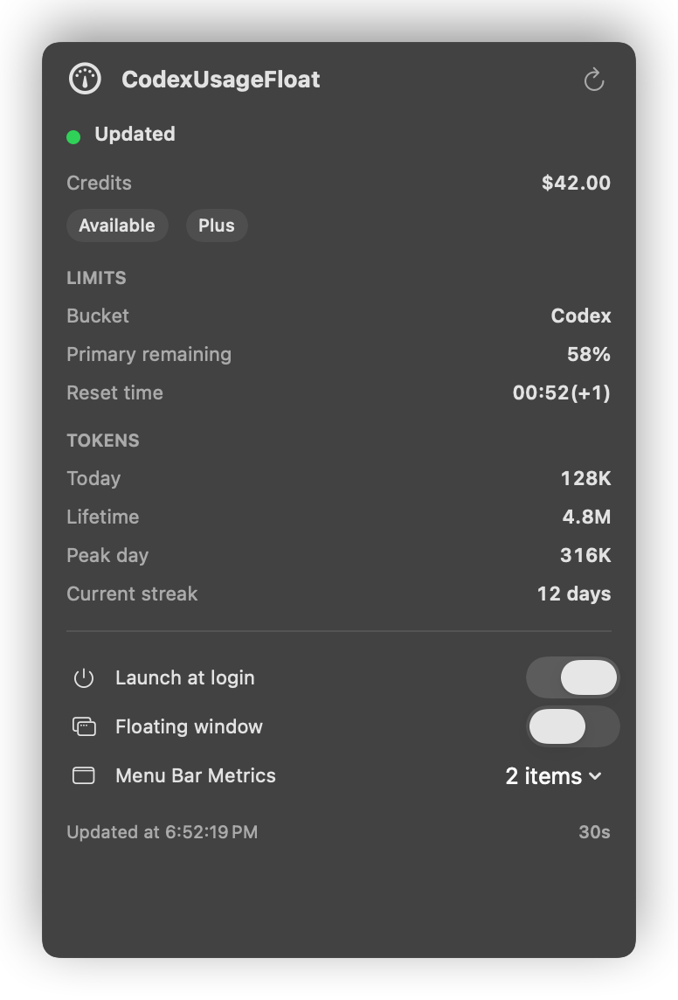

# CodexUsageFloat

一个用于显示代码智能体用量状态的小型 macOS 菜单栏工具。当前 provider 是 Codex，底层通过本地 Codex app-server 获取数据。

## 界面预览

<p align="center">
  
</p>

## 构建

```bash
swift build -c release
```

## 运行测试

```bash
swift test
```

## 打包为应用

```bash
scripts/package-app.sh
open dist/CodexUsageFloat.app
```

## 安装登录启动 LaunchAgent

```bash
scripts/install-launch-agent.sh
```

如需在不安装的情况下验证 LaunchAgent plist：

```bash
DRY_RUN=1 PLIST_PATH=/tmp/com.local.codex-usage-float.plist scripts/install-launch-agent.sh
```

## 卸载

```bash
scripts/uninstall-launch-agent.sh
```

应用采用面向 provider 的设计：

- `AgentUsageCore` 负责通用用量模型和 `UsageProvider` 协议。
- `CodexUsageProvider` 是第一个 provider 实现，优先通过 `/Applications/ChatGPT.app/Contents/Resources/codex app-server --stdio` 读取用量，并兼容旧版 `Codex.app` 路径。
- `CodexUsageFloat` 渲染 `UsageProvider` 提供的内容，因此新增代码智能体时无需重写菜单栏 UI。

应用不会读取 `~/.codex/auth.json`，也不会持久化 token、邮箱地址或原始 provider 响应。
